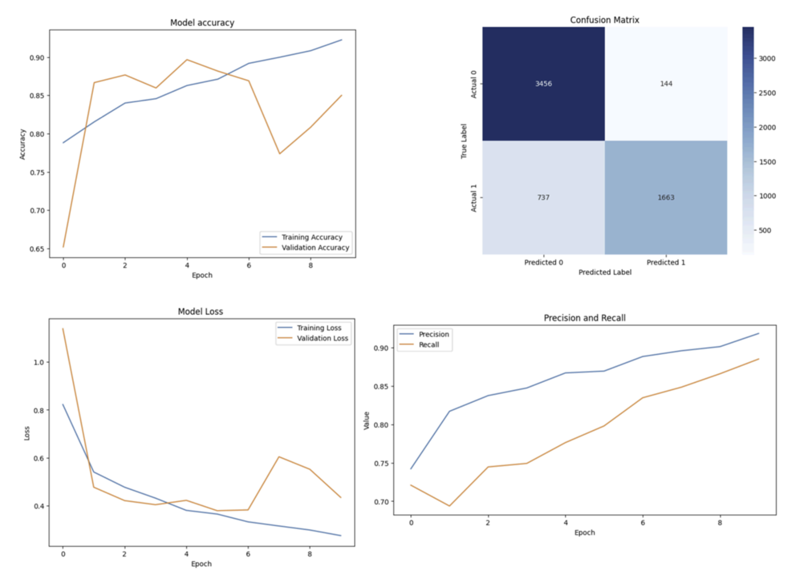
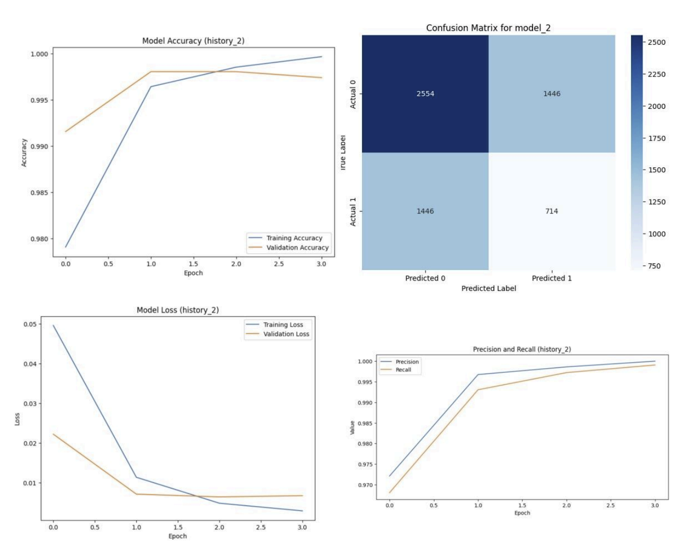

# AI-Driven Melanoma Classification 🩺

### **Project Overview**
This project focuses on the early detection of melanoma using deep learning techniques. By leveraging Convolutional Neural Networks (CNN) and Transfer Learning, the system provides an automated tool to assist in the diagnostic process of skin lesions. 

The primary challenge addressed in this project is the **significant class imbalance** common in medical datasets, where malignant cases are far fewer than benign ones.

---

### **The Dataset**
* **Source:** ISIC (International Skin Imaging Collaboration) Archive, sourced via Kaggle.
* **Content:** 33,126 dermoscopic images (512x512 JPEG format).
* **Challenge:** Only 550 images were initially labeled as melanoma, representing a high class imbalance.

---

### **Methodology**
#### **1. Data Preprocessing & Augmentation**
To handle the limited number of melanoma samples, I implemented rigorous **Data Augmentation** on the positive class only, including:
* Random rotation, flipping (horizontal/vertical), and noise injection.
* Image resizing: Model 1 used 64x64, while Model 2 used 224x224.
* Pixel normalization and color format conversion.

#### **2. Model Architectures**
I evaluated two distinct approaches to determine the most effective classification method:

* **Model 1: Custom CNN** - A built-from-scratch architecture consisting of two Conv2D layers (32/64 filters), Max-Pooling, Batch Normalization, and Dropout layers to prevent overfitting.
* **Model 2: MobileNetV2 (Transfer Learning)** - Utilizing a pre-trained model (on ImageNet) as a feature extractor, with custom dense layers for binary classification.

---

### **Comparative Results**

The **Custom CNN (Model 1)** was selected as the preferred model due to its better balance between precision and recall, which is critical for clinical safety.

| Metric | Model 1 (Custom CNN) | Model 2 (MobileNetV2) |
| :--- | :--- | :--- |
| **Accuracy** | **92.33%** | \~99.5% (Val) |
| **Precision** | **91.98%** | \~99.0% |
| **Recall** | **87.85%** | \~98.0% |
| **F1-Score** | **79.05%** | 93.9% (Train) |

**Technical & Clinical Insights:**

  * **Model 1** achieved convergence within **10 epochs** using the Adam optimizer and Binary Crossentropy loss. **Early Stopping** was implemented to maintain generalization and prevent overfitting.
  
  * While **Model 2** showed higher overall accuracy, it exhibited a significant number of **False Positives and False Negatives**, potentially leading to dangerous clinical misdiagnoses[cite: 339, 340].
    
 
 The Custom CNN (Model 1) provided a more reliable diagnostic tool by prioritizing the reduction of critical classification errors.

---

### **Tech Stack**
* **Frameworks:** TensorFlow
* **Data Processing:** Pandas, NumPy, OpenCV, ImageDataGenerator.
* **Visualization:** Matplotlib

---

### **Future Work**
* Expanding the dataset to include multi-class classification for different types of skin lesions.
* Implementing advanced architectures like **EfficientNet** or **ResNet** for further fine-tuning.
* Integrating clinical metadata (patient history) to enhance prediction accuracy.
